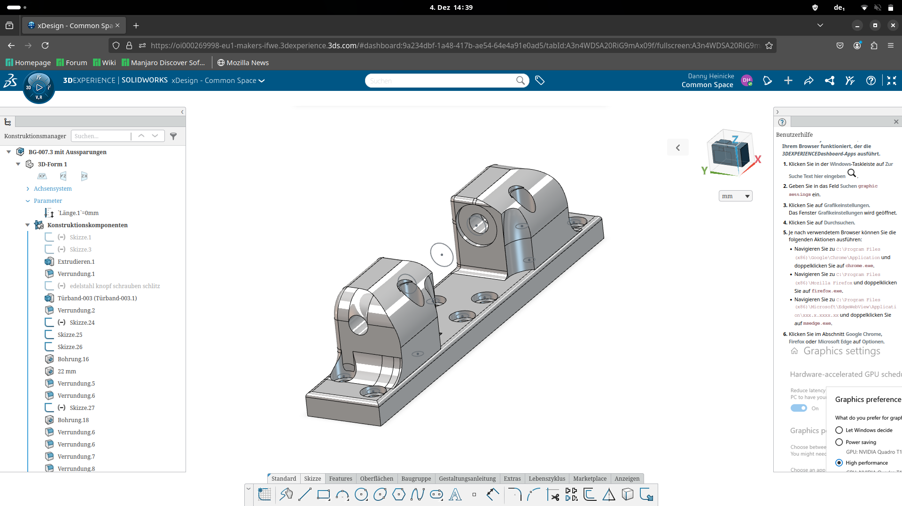
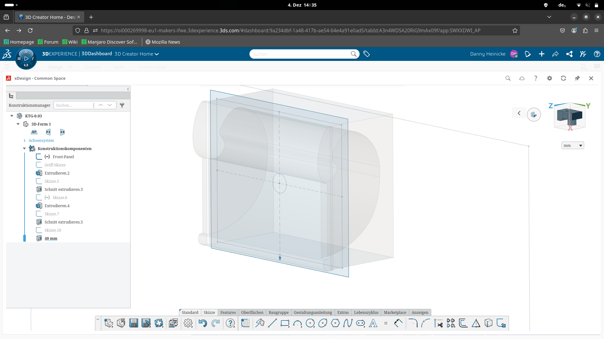

# OrcaSlicer

DIY - 3d Druck

mit OrcaSlicer #6276

[Parameter](https://github.com/OrcaSlicer/parameter)

[OrcaSlicer - Reddit](https://www.reddit.com/r/OrcaSlicer/)

[OrcaSlicer - Official](https://orca-slicer.com/)

## Kühlraumtür - Scharnier

Beispiel:

## Kühltisch - Griff

Beispiel:

